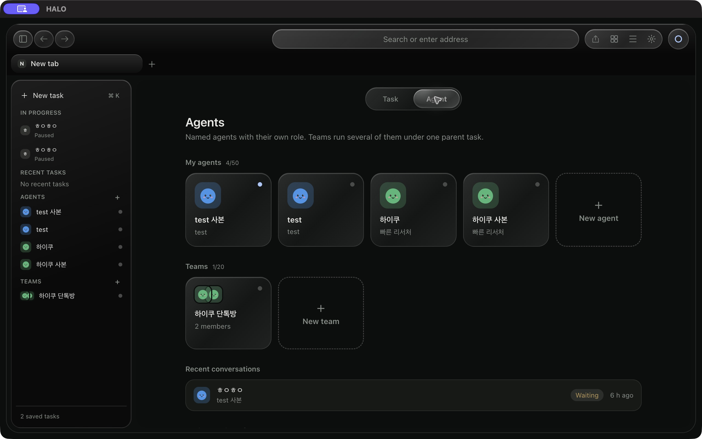

# HALO Browser

Electron browser and task runtime for HALO. The renderer presents tasks, agents,
team rooms, approval queues and browser controls. The host owns task state,
planner connections, browser execution and durable recovery.

See [HALO Core](../../halo/README.md) for containment research and the gateway,
and the [architecture guide](../../docs/ARCHITECTURE.ko.md) for component boundaries.



## Run

Run these commands from the repository root. Install a Node.js version compatible
with the pinned Electron, TypeScript and Vite packages, and Python 3.11+ for the
local approver. Planner setup is covered by the [provider guide](main/harness/providers/README.ko.md).

```sh
npm --prefix frontend ci
npm --prefix apps/computer-browser ci
npm --prefix apps/computer-browser start
```

`start` checks generated runtime files, builds the React renderer and launches
Electron. If runtime TypeScript sources changed, regenerate their JavaScript
outputs before starting:

```sh
npm --prefix apps/computer-browser run build:runtime
```

## Source ownership

| Directory | Responsibility |
| --- | --- |
| `../../frontend/` | React UI source; the app build consumes its renderer bundle |
| `main/index.js` | Electron bootstrap and production dependency wiring |
| `main/ipc.js`, `preload/` | Validated host interface exposed to the renderer |
| `main/harness/` | Task coordination, journals, planners, approval, resources and local stores |
| `runtime-src/` | TypeScript sources for migrated runtime modules |
| `shared/`, `contracts/` | Shared contracts and validation |
| `approver/` | Separate local Python approval service |
| `test/`, `integration/`, `fixtures/` | Unit tests, integration probes and benchmark fixtures |

Consult [TypeScript migration](TYPESCRIPT-MIGRATION.md) before editing generated
runtime modules and [contract conformance](contracts/README.md) before changing
persisted or cross-process data.

## Verify

```sh
npm --prefix apps/computer-browser run typecheck
npm --prefix apps/computer-browser test
npm --prefix frontend test
npm --prefix apps/computer-browser run test:renderer:e2e
```

Electron integration tests require a desktop session. Unit tests with fake
transports do not establish live provider or operating-system isolation behavior.

## Execution boundaries

Automatic browser actions include observation, navigation, link following,
scrolling, click, text replacement and native form submission. Interactions use
one-use DOM bindings and require a fresh observation for each step. See the
[interaction contract](contracts/BROWSER-INTERACTIONS.md) for action shapes,
uncertainty handling and the loopback Electron verification command.
Downloads and coordinate computer-use remain unavailable.

Antigravity (`agy`) and Cursor (`agent`) are experimental planner choices in
Settings and the model picker. They use private temporary profiles and explicit
API-key authentication; desktop subscription login is not inherited. See
[external planner setup and limits](contracts/EXTERNAL-PLANNERS.md). Vendor tool
deny policies are not an OS sandbox, and live CLI containment is not certified.

Planner failures now pause the task as soon as a correlated error arrives;
they no longer wait for the 60-second response deadline after a known CLI failure.
See the [failure and shutdown contract](contracts/PLANNER-FAILURES.md).

The NVIDIA NIM planner is selectable in Settings and supports DeepSeek V4,
Kimi K3 and Nemotron 3 Super through the hosted API. Set `NVIDIA_API_KEY` in
the host environment; see [NVIDIA setup and limits](contracts/NVIDIA-PLANNER.md).

OpenCode CLI is also available as an experimental planner. It uses OpenCode's
configured default model and local auth, but sends task context to that model
provider and persists its run in OpenCode's local session store. HALO starts a
standalone run in a private empty directory with an empty plugin config and
denies all OpenCode tools, including MCP tools. Host-level OpenCode or
managed configuration can still affect server startup, so this is a
vendor-policy boundary, not an OS sandbox; do not use it with untrusted local
MCP definitions. Fast mode and OpenCode token accounting are not supported.

The long-running path uses TaskHost → TaskController → BrowserAdapter. The legacy
ControlApi browser demo has its own lifecycle and IPC methods. The host assigns
epochs and checks policy before dispatch; planner proposals and page content are
untrusted input. Browser permission modes are `observe`, `browse`, `interact` and
`full`; MCP proposals require human approval independently of that mode.

The Electron app starts a local Python approver. Running the Docker gateway is a
separate workflow, and does not by itself place browser tasks inside containers.
Task and agent session partitions have different lifetimes; agent-bound tasks can
share an agent session. Recovery and `execution_uncertain` require review rather
than assuming an interrupted action can safely execute again.

Task prompts may include at most two small, host-authored playbooks selected
from the user's request. They cover security reviews, research, consequential
forms, bounded extraction and long tasks; they provide guidance only and never grant
capabilities. HALO does not load third-party plugin code. See
[the skills and plugin review](contracts/HALO-SKILLS-PLUGINS.md).

Planner guidance also adapts on each turn to the host's fast/long task context,
available MCP tools and explicit local planning preferences. Travel and
multi-source workflows retain source evidence and original QR assets; artifact
creation requires an available tool. See [model tuning and local preference
examples](contracts/PLANNER-MODEL-PROMPT-GUIDANCE.md).
